
Entra en mongo

Instala el servicio de cliente MONGO

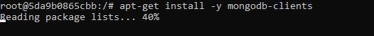

Instala el servicio de mongo

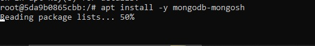

Descarga los paquetes de mongo

![ref1]

descarga los paquetes de mongo

![ref2]

Entra al servicio SQL SERVER

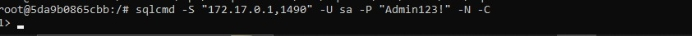

Acepta la licencia de sql SERVER

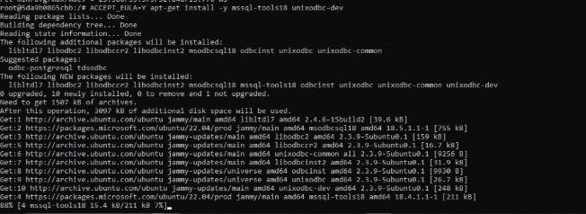

Estadisticas con google SQL SERVER

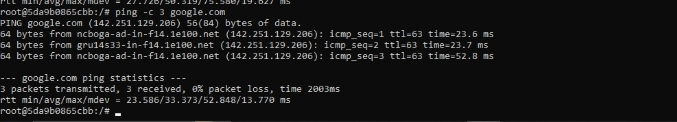

prueba la conexion a la nube SQL SERVER

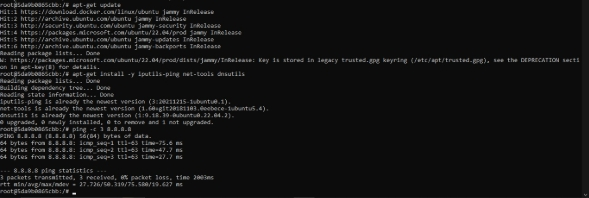

crea un repositorio SQL SERVER

Actualiza sql server

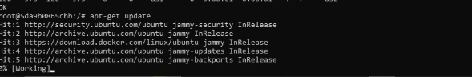

Descarga paquetes oficiales de SQL server

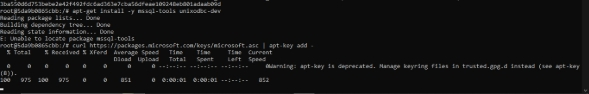

Crea docker sql server DinD

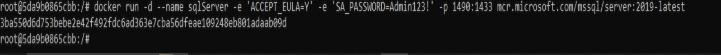

Entra a POSTGRES

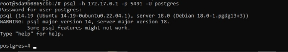

Instala el cliente POSTGRES

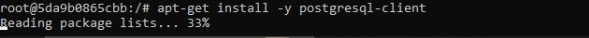

Crea el docker POSTGRES DinD

entra en MYSQL

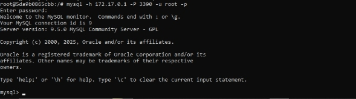

instala el servicio MYSQL

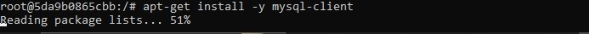

Crea mysql DinD

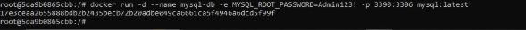

Da permisos al usuario DinD

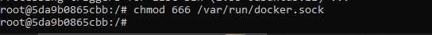

crea el repositorio DinD.jpg

Instala certificados DinD

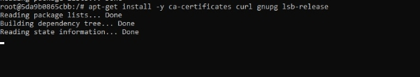

herramientas DinD

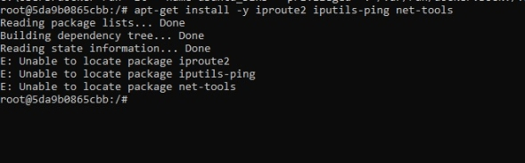

creacion de DinD

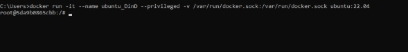

[ref1]: Aspose.Words.861bf5e5-afd1-4260-bf08-d4d96ecc7640.004.jpeg
[ref2]: Aspose.Words.861bf5e5-afd1-4260-bf08-d4d96ecc7640.005.jpeg
