Aprendiz: Jhon Camilo Suaza Sánchez

Ficha:3145555

Acá entramos para ejecutar la base de datos desde consola con MYSQL

conectar correctamente desde Docker:

docker exec -it mysql-db mysql -u root -p

la contraseña

camilo123!

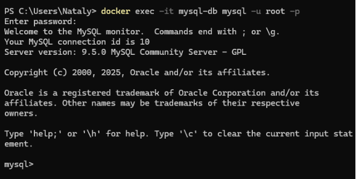 

Acá se empieza a crear la base de datos desde consola con MYSQL

Creación de la base de datos desde consola en MYSQL

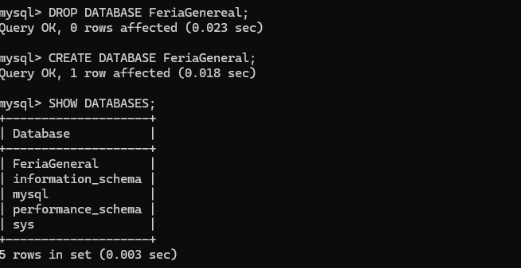

Creación de las tablas 

Creacion de las tablas

Ver tablas creadas en la base de datos

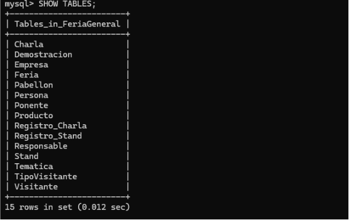

Ya acá se empieza a ejecutar los INSERT que era 1.000 por cada tabla creada de la base de datos 

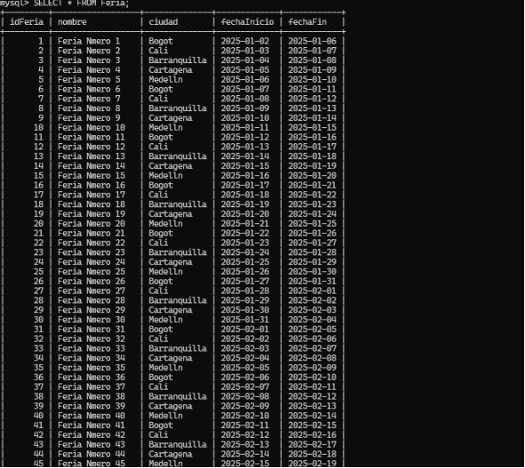

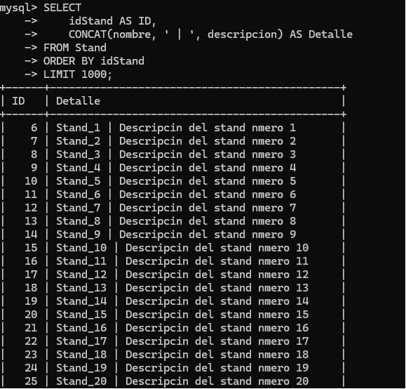

Después de hacer ese mismo proceso para todas las tablas que ya quedaron con su 1.000 registro se empieza a ejecutar las consultas 

**Consulta**

Acá ya se empieza las consultas, la 1 es Mostrar stands con su empresa

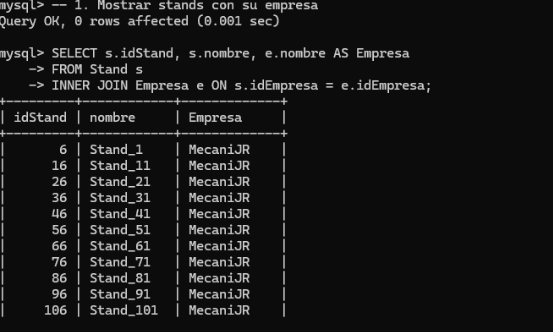

La 2 es Mostrar pabellones con sus stands

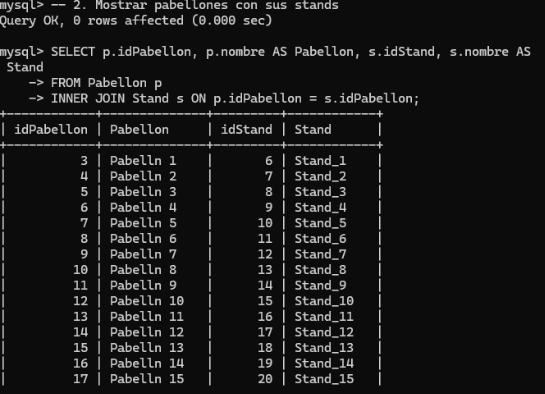

La 3 Mostrar empresas con sus productos

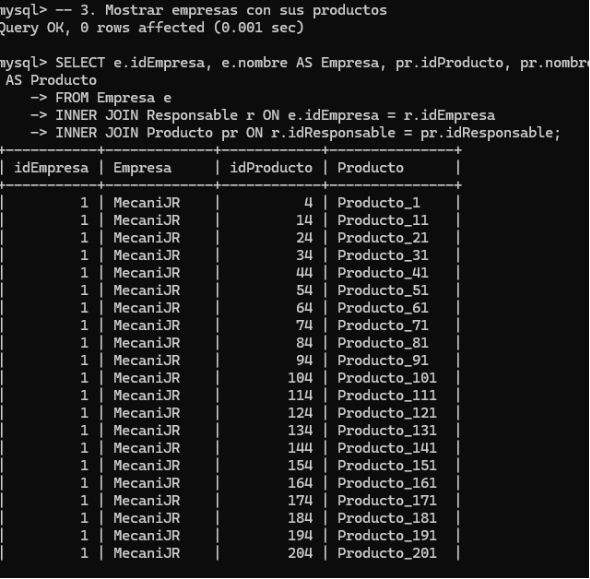

La 4 Muestra los visitantes y los eventos (charlas) a los que asistieron

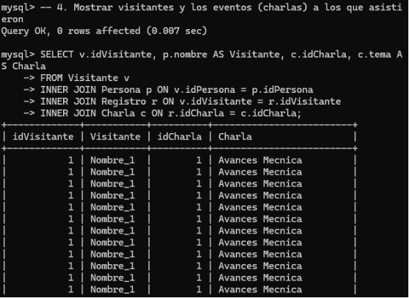

**Subconsultas**

Charlas que existen en la feria

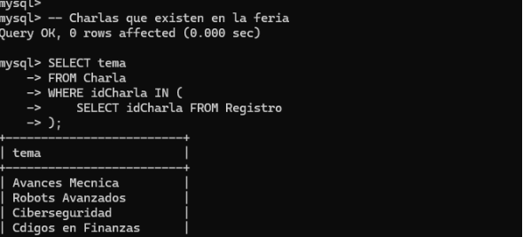

Pabellones con stands

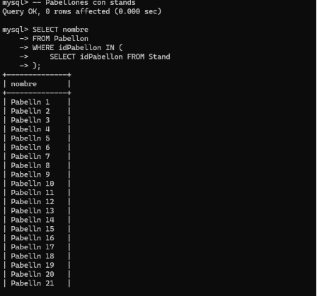

Empresas que participan en alguna charla

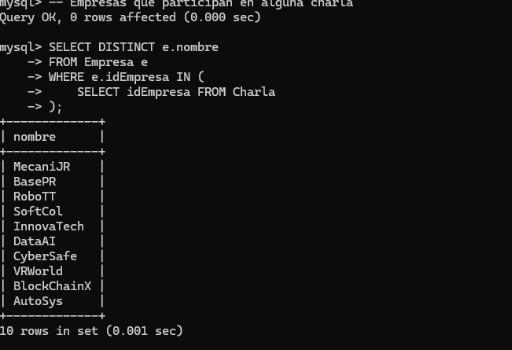

Visitantes inscritos en alguna charla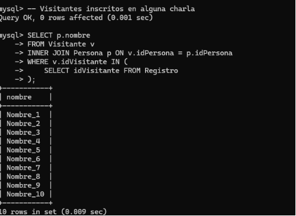

**Acá se empieza ya con el tema de roles y contraseña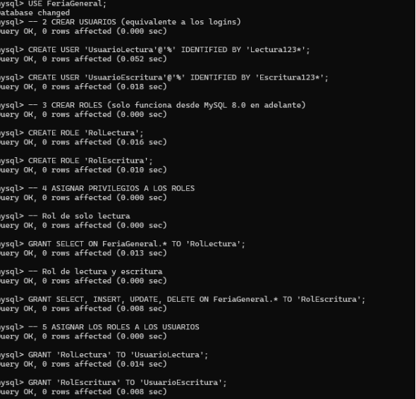**

Explicación

USAR LA BASE DE DATOS

USE FeriaGeneral;

CREAR USUARIOS (equivalente a los logins)

CREATE USER 'UsuarioLectura'@'%' IDENTIFIED BY 'Lectura123\*';

CREATE USER 'UsuarioEscritura'@'%' IDENTIFIED BY 'Escritura123\*';

` `CREAR ROLES (solo funciona desde MySQL 8.0 en adelante)

CREATE ROLE 'RolLectura';

CREATE ROLE 'RolEscritura';

ASIGNAR PRIVILEGIOS A LOS ROLES

Rol de solo lectura

GRANT SELECT ON FeriaGeneral.\* TO 'RolLectura';

Rol de lectura y escritura

GRANT SELECT, INSERT, UPDATE, DELETE ON FeriaGeneral.\* TO 'RolEscritura';

ASIGNAR LOS ROLES A LOS USUARIOS

GRANT 'RolLectura' TO 'UsuarioLectura';

GRANT 'RolEscritura' TO 'UsuarioEscritura'; 

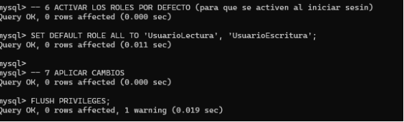

` `ACTIVAR LOS ROLES POR DEFECTO (para que se activen al iniciar sesión)

SET DEFAULT ROLE ALL TO 'UsuarioLectura', 'UsuarioEscritura';

APLICAR CAMBIOS

FLUSH PRIVILEGES;

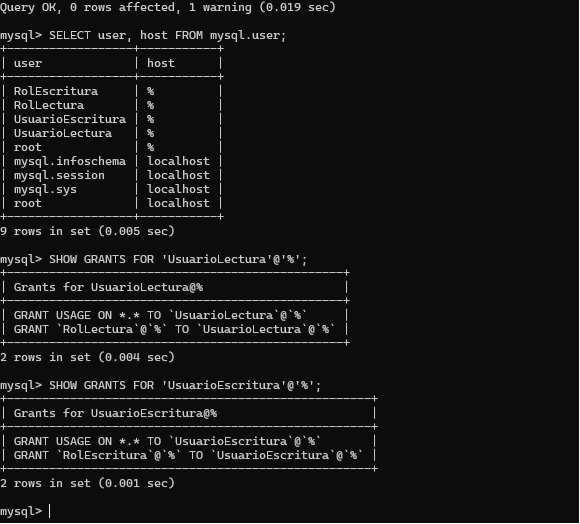

Luego verifica que se crearon correctamente:

SELECT user, host FROM mysql.user;

SHOW GRANTS FOR 'UsuarioLectura'@'%';

SHOW GRANTS FOR 'UsuarioEscritura'@'%';

Acá lo que miramos es que ejecute el comando para poder mirar las tablas y la cantidad la cual nos dice en cada tabla el nombre y al lado la cantidad de datos insertados.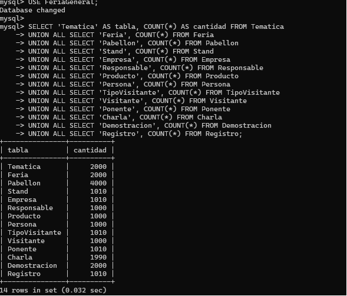
