Actualización de paquete SQL SERVER

Descarga de paquetes SQL SERVER

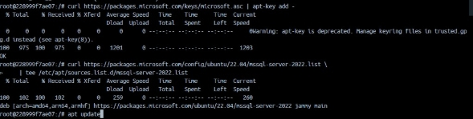

Instalación de herramientas SQL SERVER

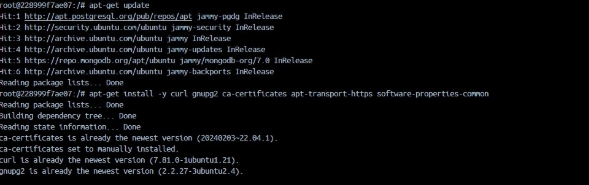

instalación de herramientas SQL SERVER

![ref1]

Creación de usuario MONGO

![ref1]

Actualización mongo

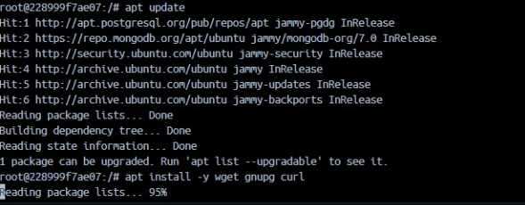

Mongo DB

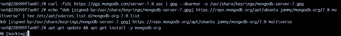

Creación del usuario y seguido la entrada y salida a el contenedor Ubuntu (FIN POSTGRES).jpg

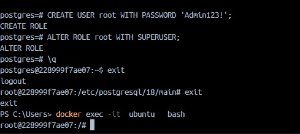

ENTRADA A POSTGRES

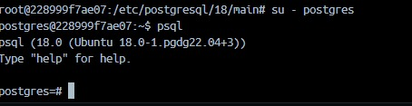

Listening de POSTGRES

actualiza  POSTGRES

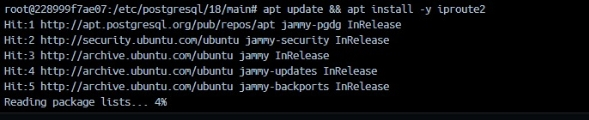

reinicia el servicio POSTGRES

Añade  puerto a POSTGRES

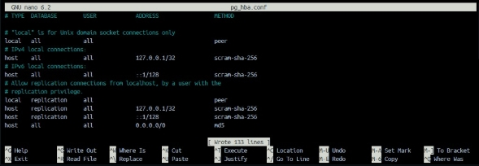

cambio de puerto a 0.0.0.0 POSTGRES

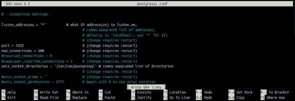

Dirección del repositorio en el pc y entrada a el.

tools postgres.jpg

postgres

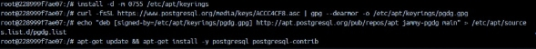

listening mysql

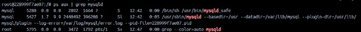

start service mysql

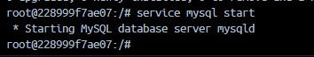

restart mysql

mysql usuario

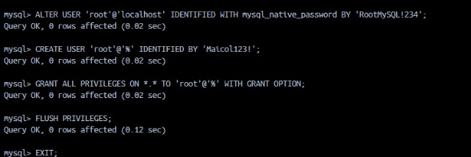

mysql

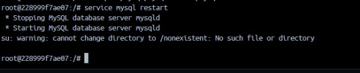

conexion 0.0.0.0 MYSQL

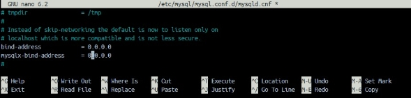

mysql(1)

ubuntu(5)

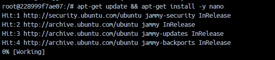

ubuntu(4)

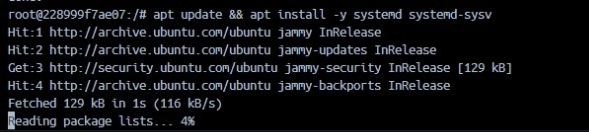

ubuntu(3)

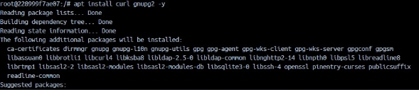

ubuntu(2)

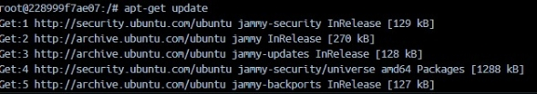

Abuntu.

[ref1]: Aspose.Words.78f84c95-0a92-4816-9ed3-58870161a817.004.jpeg
